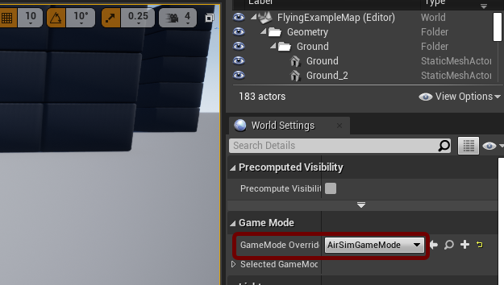
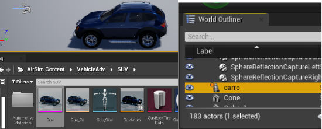

# sinteticDatasetSBRT
Repository to have the codes make to the sbrt paper

## Instalation of Unreal, Airsim and the Map
* Install Unreal engine by the EpicGames, the version used was the 4.27, folowing:
https://docs.unrealengine.com/4.27/en-US/SharingAndReleasing/Linux/BeginnerLinuxDeveloper/SettingUpAnUnrealWorkflow/
* Install the Airsim repository by following: https://microsoft.github.io/AirSim/build_linux/
* Download the map of https://www.unrealengine.com/marketplace/en-US/product/landscape-
mountains or use the Airsim "Blocks".

## Configuration of the Map
* Be sure that the map (blocks or Mountain Landscape) has in the World Setting, GameMode Overide as AirSimGameMode
  
  
* To get the car model provided by Airsim, go to the folder Airsim Content/VehicleAdv/SUV and drag the Suv Skeletal Mesh to the map. After that, you can change the name of the object in thhe world Outliner setting.
  
  

## Configuration of the Airsim Settings
* To cofigure the Airsim Settings, got to the Airsim folder into the Documments and change the settings.json to be as:
  ```
  {
  "SeeDocsAt": "https://github.com/Microsoft/AirSim/blob/master/docs/settings.md",
  "SettingsVersion": 1.2,
   "ExternalCameras": {
        "fixed1": {
            "X": 0, "Y": 0, "Z": 5,
            "Pitch": -90, "Roll": 0, "Yaw": 0
        }
    }
  }
This will allow the use of external Camera.

## Repository's instalation for python
* install the repository in the requirements with the command line:
  ```
  pip install -r requiriments.txt

## Executing the Codes
* First, in Unreal, click on the play button and in the following text, chose whatever you want (The camera is external so the type of vehicle will not influence over the photos)
* In the prompt, type:
  ```
  python3 gettingPicturesAirsim.py -n "nameOfObject" -i "numberOfImages"
This will generate the folders dataset/images/ where is stored the photos and the folder dataJson/ where is stored information about the elements in the photos

* After taken the photos, type:
  ```
  python3 automatBoundingBox.py
This will place the bounding boxes in the object choose and generate data with the yolov7 format with the BB's position in the photo and the class. The Yolo data is stored in dataset/labels/ and the photos with the bounding box is stored in fotosBB/
